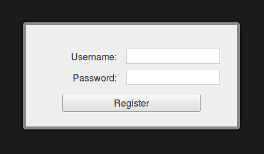

# Register

Display registration modal form allowing users to create XMPP account in the server.



## Usage
To enable *Register* you have to include the Strophe registration plugin `strophe-register.js` and this plugin's Javascript `register.js`:

```HTML
<script type="text/javascript" src="candyshop/register/strophe.register.js"></script>
<script type="text/javascript" src="candyshop/register/register.js"></script>
```

Call its `init()` method after Candy has been initialized, then just call its `showRegistrationForm()` method, where you would have called `Candy.Core.Connect() method to display usual Candy connection modal form:

```JavaScript
Candy.init('/http-bind/', {core: {autojoin: []}});
// enable Register plugin
CandyShop.Register.init();

CandyShop.Register.showRegistrationForm();
```

Upon successful registration, the user will be automatically connected.
