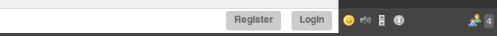

# Register Connect Buttons

A plugin for Candy Chat to display buttons allowing visitors to either register or login and disable message form.

This is useful in the common scenario where you want to allow unregistered users to view chatrooms, without being able to write any message.

In this case, create a user on XMPP server with _visitor_ role in the desired chatrooms. Connect such user with `Candy.Core.Connect('JID', 'password')` (or attach to authentified session on the server side with `Candy.Core.attach(jid, sid, rid)`). Then use this plugin to disable the message form, and to show instead a pair of buttons, allowing users to either register themselves if they don't have an account yet, or login in using an existing account.

## Dependencies
 Depends on `CandyShop.Register` plugin which allows registration.



## Usage
Include the JavaScript and CSS files for the plugin:

```HTML
<link rel="stylesheet" type="text/css" href="candyshop/register_connect_buttons/register_connect_buttons.css" />
<script type="text/javascript" src="candyshop/register_connect_buttons/register_connect_buttons.js"></script>
```

To enable this plugin, add its `init` method after you `init` Candy and the Register plugin:

```JavaScript
Candy.init('/http-bind/', {core: {autojoin: []}});
// enable Register plugin
CandyShop.Register.init();
// enable Register Connect Buttons plugin
CandyShop.RegisterConnectButtons.init();
```
